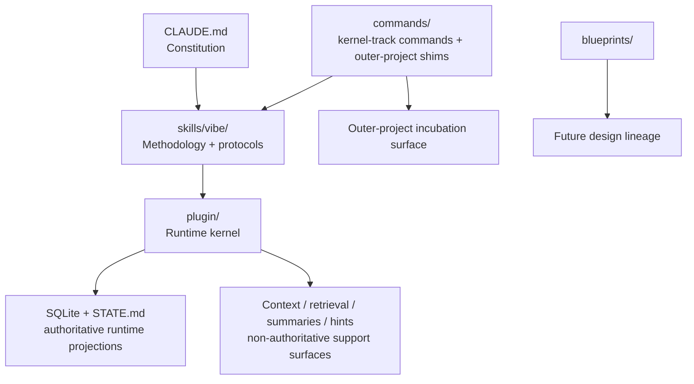

# Current Vibe Science System Map

**Status:** Canonical snapshot of the current system  
**Date:** 2026-03-28  
**Purpose:** Describe what Vibe Science actually is now, before broadening around it

---

## Why This Document Exists

Vibe Science started as a Claude Code skill and has now become a real multi-layer system.

That growth is valuable, but it also creates a risk: if the current system is not mapped explicitly, future work will blur together:

- hard kernel vs soft shell
- runtime truth vs methodological intent
- current implementation vs future ambition

This document is the "what exists now" map.

It is intentionally different from the broader-system blueprints:

- this file describes the system that exists today
- the broader-system specs describe the larger environment that may be built around it

---

## One-Sentence Summary

**Vibe Science today is an integrity-first research runtime for Claude Code composed of a constitutional layer, a methodology layer, and a plugin kernel that persists and enforces a valuable subset of the methodology at runtime.**

---

## Top-Level Composition

The current repository contains five distinct layers:

1. **Constitution**
   `CLAUDE.md` defines immutable laws, roles, and behavioral constraints.
2. **Methodology**
   `skills/vibe/` defines OTAE, Reviewer 2 posture, gate universe, protocols, and research discipline.
3. **Runtime kernel**
   `plugin/` persists state, blocks selected bad moves, and projects carry-over context.
4. **Support surfaces**
   retrieval, narrative summaries, calibration hints, patterns, harness hints, and a now-mixed `commands/` directory containing both kernel-track commands and outer-project prompt shims.
5. **Design lineage**
   `blueprints/`, archived releases, and implementation specs that explain how the system evolved.

---

## Runtime Inventory

### Hook Backbone

The kernel currently runs on **7 lifecycle hooks**:

1. `SessionStart`
2. `UserPromptSubmit`
3. `PreToolUse`
4. `PostToolUse`
5. `Stop`
6. `PreCompact`
7. `SubagentStop`

These are the hard spine of runtime behavior.

### Supporting Runtime Scripts

The plugin also includes **3 support scripts** that are not lifecycle hooks:

- `setup.js`
- `worker-embed.js`
- `core-reader-cli.js`

### Library Surface

The plugin currently includes **19 library modules**. In practical terms they cluster into:

- persistence and migrations
- gate and permission enforcement
- claim / citation / seed / review ingestion
- context building and retrieval
- narrative, patterns, calibration, and benchmarking
- path normalization and structured parsing

### Commands

The repo currently exposes **8 top-level command files**:

- `init`
- `loop`
- `reviewer2`
- `search`
- `start`
- `flow-status` (outer-project command shim — Phase 1)
- `flow-literature` (outer-project command shim — Phase 1)
- `flow-experiment` (outer-project command shim — Phase 1)

The first 5 are kernel-track operator entrypoints.
The `flow-*` commands are outer-project command shims. They are prompt assets, not executable JS modules, and they consume structured kernel facts through the live `core-reader.js` / `core-reader-cli.js` bridge when available. They remain part of the outer-project incubation surface and do not modify kernel truth.

### Implemented Read Surface

The following kernel-side surfaces are now implemented as runtime code:

- `plugin/lib/core-reader.js` — read-only contract surface for outer-project consumption. Factory + 8 projection functions. Spec: [CORE-READER-INTERFACE-SPEC.md](./CORE-READER-INTERFACE-SPEC.md).
- `plugin/scripts/core-reader-cli.js` — CLI bridge that exposes core-reader projections as JSON on stdout for prompt-driven command shims. Stable envelope contract defined in the interface spec.

### Database Footprint

The current schema defines:

- **16 regular table definitions** (including the optional `memory_embeddings` fallback table)
- **1 live FTS virtual table** (`memory_fts`)
- **optional vector-memory path** (`vec_memories` remains optional / commented)

The regular tables currently visible in the runtime schema are:

1. `meta`
2. `sessions`
3. `spine_entries`
4. `claim_events`
5. `r2_reviews`
6. `serendipity_seeds`
7. `gate_checks`
8. `literature_searches`
9. `citation_checks`
10. `observer_alerts`
11. `calibration_log`
12. `prompt_log`
13. `memory_embeddings`
14. `embed_queue`
15. `research_patterns`
16. `benchmark_runs`

Important nuance:

- `memory_embeddings` is a documented fallback regular table for environments where `sqlite-vec` is unavailable
- the schema definition includes it, but a given runtime may rely on `vec_memories` instead
- so "16 regular tables" is a schema-level count, not a guarantee that every runtime instance materializes the same embedding path

---

## What The Kernel Actually Owns

The current kernel is not "the whole methodology."

It specifically owns:

- project identity normalization
- session lifecycle persistence
- research spine logging
- claim lifecycle persistence
- citation verification state
- gate history and gate consequences
- session integrity status
- observer alerts, serendipity seeds, and patterns
- kernel-authored carry-over projections at `SessionStart`

This is the authoritative runtime truth layer.

---

## Capability Map By Enforcement Level

### Runtime-Enforced

These are currently enforced by code, not only by prompt discipline:

- `CLAIM-LEDGER` pre-write barriers for `confounder_status` / `NOT_APPLICABLE`
- protection against unsafe direct governance mutation paths
- TEAM permission boundaries and role-based file/tool restrictions
- hard gate core:
  - `DQ4`
  - `L-1+`
  - `L0`
  - `D1`
  - claim-gate aggregation
  - `SALVAGENTE`
- stop-time blocking when claim lifecycle is unresolved
- subagent-stop enforcement when killed claims lack seeds
- persisted integrity degradation state, with strict-mode fail-loud behavior

Short version:

**the kernel can currently deny, block, or fail loud on a meaningful subset of the scientific runtime.**

### Runtime-Observed

These are real runtime subsystems, but they are not themselves the final arbiters of truth:

- session creation and full spine logging
- literature-search logging
- claim, citation, R2, and seed ingestion
- observer scans and alert persistence
- semantic retrieval and memory recall
- narrative summaries and `STATE.md` projection
- active patterns and cross-session pattern extraction
- R2 calibration hints
- TRACE+ADAPT harness hints
- benchmark/eval persistence and reporting
- PreCompact resilience snapshots

Short version:

**the runtime already remembers, summarizes, recalls, and carries context across sessions, but those support surfaces do not redefine scientific truth.**

### Methodology-Only Or Only Partially Mechanized

These are still mostly defined by the constitution, skill, and protocols rather than fully guaranteed by the runtime:

- most of the `32`-gate universe beyond the implemented subset
- the full semantic LAW 9 judgment:
  - raw
  - conditioned
  - matched
  - artifact / confounded / robust adjudication
- the full R2/SFI/BFP/J0 protocol stack as a semantically verified runtime loop
- OTAE tree search requirements and exploration policy
- stage-manager semantics for the whole research lifecycle
- the full instinct model beyond currently implemented patterns and harness hints

Short version:

**the methodology is broader than the kernel.**

That is not a flaw as long as the distinction remains explicit.

---

## Core vs Shell-ish Surfaces Already Present

The repo already contains a small shell around the kernel.

### Hard Kernel

Treat these as core-authoritative:

- hook chain
- database schema and DB wrapper
- gate engine
- permission engine
- claim / citation truth state
- stop semantics
- session integrity model
- canonical path normalization

### Shell-ish But Already Present

Treat these as useful support surfaces, not truth authorities:

- `context-builder.js`
- `narrative-engine.js`
- `pattern-extractor.js`
- `r2-calibration.js`
- `benchmark-reporter.js`
- `harness-hints.js`
- retrieval infrastructure and semantic recall
- top-level commands
- blueprint planning docs

This matters because the broader system should mostly extend the second group, not destabilize the first.

---

## What Vibe Science Is Not Yet

Vibe Science is **not yet** a full semi-automated PhD environment.

What is still missing at system level:

- literature operations as a full outer workflow
- experiment operations as a first-class environment
- human-readable project memory mirrors
- reporting and writing handoff infrastructure
- external connectors such as Zotero / Obsidian adapters
- recurring digests and operator automations
- domain-pack loading beyond the current light domain-config support

Those belong to the broader environment work, not to the kernel definition itself.

---

## Boundary Line For Future Work

The clean architectural split going forward is:

Interpretation:

- the kernel owns runtime truth
- the outer system consumes projections of that truth
- outer layers may package, synchronize, mirror, summarize, and orchestrate
- outer layers must not redefine claim truth, citation truth, gate semantics, or stop semantics

---

## Current Design Implication

Before writing the broader-system implementation plan, two artifacts are required:

1. a canonical map of what Vibe Science is now
2. a canonical contract of what the kernel owns and exposes

This file is artifact `1`.

The next companion document is:

- `VIBE-SCIENCE-CORE-CONTRACT.md`
