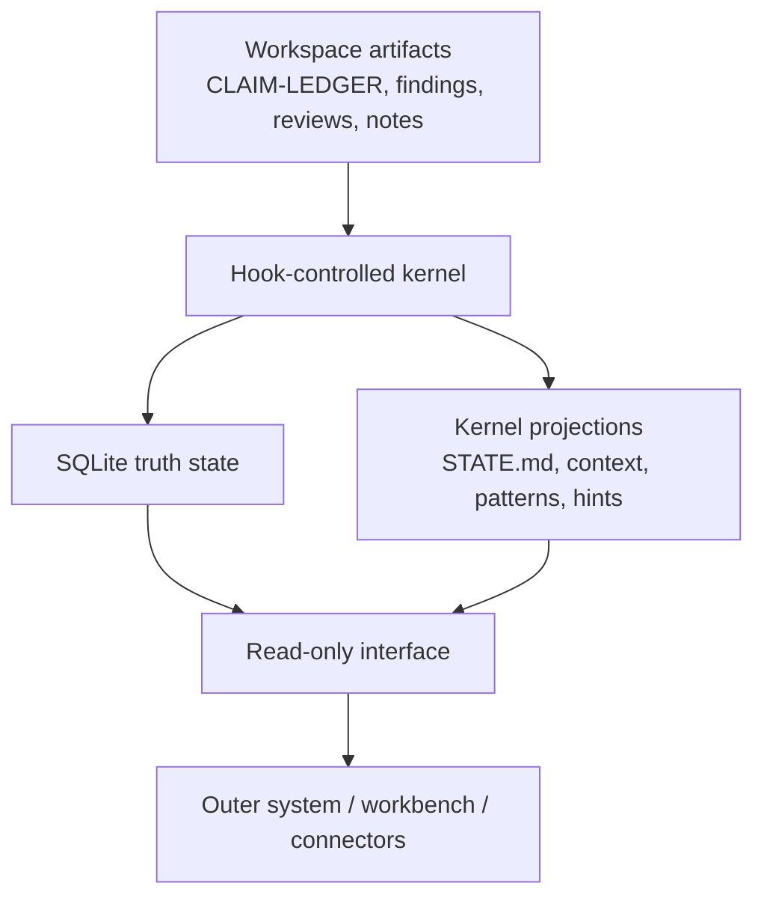

# Vibe Science Core Contract

**Status:** Canonical kernel boundary document  
**Date:** 2026-03-27  
**Purpose:** Define what the Vibe Science core owns, what external systems may consume, and what must never be bypassed

---

## Why This Document Exists

If Vibe Science is going to become the kernel of a broader research environment, the kernel must stop being described only by intuition.

It needs a contract.

This document defines:

- what the core owns
- what the core exposes
- which write paths are protected
- how outer systems may interact with the core without corrupting it

---

## Core Thesis

**Vibe Science core is the authoritative runtime for research integrity state.**

That means the core, not the shell, owns:

- claim truth state
- citation truth state
- gate semantics
- session integrity semantics
- stop semantics
- authoritative lifecycle history

Everything outside the core is downstream, advisory, mirrored, or orchestration-oriented.

---

## Kernel Boundary In One Diagram

Meaning:

- the kernel ingests and validates
- the kernel persists authoritative state
- the kernel may emit projections
- the outer system may consume projections
- the outer system must not write truth directly

---

## What The Core Owns

### 1. Project Identity

The core owns project identity normalization.

External systems must not invent their own incompatible project identity rules.
If `project_path` is not canonicalized the same way, all cross-session truth becomes unreliable.

### 2. Session Lifecycle Truth

The core owns:

- session creation
- session integrity state
- session closure
- compact resilience snapshots

No outer system may directly mark sessions as healthy, degraded, started, or ended.

### 3. Claim Lifecycle Truth

The core owns the authoritative lifecycle of claims:

- created
- reviewed
- promoted
- disputed
- killed

An external layer may summarize or visualize claim state.
It may not directly mutate the lifecycle state.

### 4. Citation Truth

The core owns citation verification state:

- extracted
- resolver used
- verified vs unresolved
- retracted / invalid detection

An adapter may help discover sources.
It may not directly mark a citation `VERIFIED`.

### 5. Gate Semantics

The core owns:

- gate definitions that are currently mechanized
- pass/fail logic
- logged gate outcomes
- the meaning of a blocked move

No outer system may weaken or reinterpret a gate to make a workflow more convenient.

### 6. Integrity Semantics

The core owns the meaning of:

- `INTEGRITY_OK`
- `INTEGRITY_DEGRADED`
- strict-mode fail-loud behavior
- degradation consequences on hook paths

### 7. Stop Semantics

The core owns the rules for ending a session safely.

No reporting, memory, or workflow layer may declare a session safely closed if the kernel would block it.

### 8. Authoritative Audit History

The core owns the persisted ledger of:

- sessions
- spine entries
- claim events
- gate checks
- citation checks
- literature searches
- R2 reviews
- serendipity seeds
- observer alerts
- patterns
- benchmarks

Outer systems may consume this history.
They must not rewrite it.

---

## Protected Write Paths

The following surfaces are core-protected and must not be changed by shell-track work without explicit core review:

- `plugin/db/schema.sql`
- `plugin/lib/db.js`
- `plugin/lib/gate-engine.js`
- `plugin/lib/permission-engine.js`
- `plugin/lib/path-utils.js`
- `plugin/lib/harness-hints.js`
- `plugin/scripts/prompt-submit.js`
- `plugin/scripts/pre-tool-use.js`
- `plugin/scripts/post-tool-use.js`
- `plugin/scripts/pre-compact.js`
- `plugin/scripts/session-start.js`
- `plugin/scripts/stop.js`
- `plugin/scripts/subagent-stop.js`
- canonical claim / citation truth flows
- integrity semantics and stop semantics

Important nuance:

The core does **not** own every workspace markdown file as authored content.
But it **does** own the authoritative mutation barrier around critical artifacts when those writes are routed through the hook chain.

In other words:

- the core may not own the prose
- the core does own the governance barrier

---

## Safe External Interaction Model

Outer systems may interact with the core in only three safe ways.

### 1. Read Projections

The preferred path is read-only consumption of kernel projections.

Examples:

- session summaries
- current integrity status
- active patterns
- recent gate history
- claim-state summaries
- pending seeds
- harness hints
- `STATE.md`

### 2. Write Normal Workspace Artifacts

An outer system may help create or update ordinary project artifacts, such as:

- notes
- draft reports
- literature inventories
- experiment logs
- paper draft fragments

But those artifacts only become authoritative when the kernel ingests and validates the relevant parts through the normal hook path.

Important boundary:

- ordinary draft artifacts may be created outside the kernel
- governance-sensitive artifacts must not bypass hook-observed mutation paths

Examples of governance-sensitive surfaces include:

- `CLAIM-LEDGER.md`
- kernel-authored review artifacts that feed lifecycle ingestion
- session-state projections such as `STATE.md`

### 3. Invoke Kernel-Safe Commands

An outer system may invoke explicit commands that the kernel or kernel-adjacent shell makes available, as long as those commands do not bypass enforcement.

---

## Prohibited External Interaction

The following are out of bounds:

- direct writes into core SQLite tables
- direct mutation of `STATE.md` as if it were an external source of truth
- external code that marks claims promoted, disputed, killed, or reviewed
- external code that marks citations verified
- external code that marks gates passed
- external code that sets session integrity or session closure state
- adapters that redefine what counts as evidence
- convenience layers that bypass hook-controlled enforcement

Short version:

**No outer layer may self-legitimate scientific truth.**

---

## Read-Only Interface Requirement

The future outer system must not couple itself directly to raw table layout.

Instead, the core exposes a stable read-only interface module: `core-reader.js` at `plugin/lib/core-reader.js`, with a CLI bridge at `plugin/scripts/core-reader-cli.js` for prompt-driven callers.

The canonical V1 function surface is defined in [CORE-READER-INTERFACE-SPEC.md](./CORE-READER-INTERFACE-SPEC.md). Do not duplicate the function list here — it will drift. The Interface Spec is authoritative for scope, signatures, and return shapes.

Design rule:

- outer systems speak to projections via `createReader()` or the CLI bridge
- only the core speaks to raw truth internals

This keeps future shell work insulated from schema churn.

The Phase 0 design for that surface is documented in:

- [Core Reader Interface Spec](./CORE-READER-INTERFACE-SPEC.md)

---

## Safe Read Classes

### Safe To Expose As External Read Models

- session summaries
- claim lifecycle heads and timelines
- gate history
- citation state summaries
- observer alerts
- pending seeds
- research patterns
- benchmark history
- latest `STATE.md` snapshot
- harness hints

### Expose Carefully

- `prompt_log`
- `calibration_log`

These are useful internally, but they should not become casual integration surfaces.

### Treat As Internal Implementation Detail

- `meta`
- `embed_queue`
- `memory_embeddings`
- `memory_fts`
- optional vector-memory internals
- low-level fallback / integrity plumbing

These may support the runtime, but they should not become external contracts.

---

## Shell Failure Contract

If the outer system fails, the core must remain trustworthy.

That means:

- memory sync failure must not corrupt claim truth
- connector failure must not mark citations verified
- writing-handoff failure must not change claim lifecycle
- automation failure must not close sessions or relax gates
- dashboard failure must not affect runtime enforcement

In practice:

**soft shell, hard kernel**

The shell may degrade experience.
It must not degrade truth.

---

## Testing Consequence Of This Contract

Any future shell module must prove three things:

1. it works when present
2. it fails gracefully
3. the kernel behaves correctly without it

This is the minimum testing burden for anything built around the core.

---

## Repo Topology Implication

This contract works with either:

- a carefully segmented single repo
- a monorepo with core and outer workspaces
- a separate outer repo that depends on Vibe Science as kernel

Architecturally, the cleanest long-term model is:

- `vibe-science` remains the protected kernel
- a distinct outer project consumes the kernel through read-only interfaces and safe command paths

The adopted V1 incubation decision is documented in:

- [Repo Topology Decision](./REPO-TOPOLOGY-DECISION.md)

The contract itself remains the same across either topology.

---

## Non-Negotiable Rule

If a proposed outer feature requires changing any of the following, it is no longer shell work and must stop for core review:

- claim truth semantics
- citation truth semantics
- gate meaning
- integrity meaning
- stop semantics
- authoritative lifecycle ownership

This file is the guardrail against accidental dilution of Vibe Science.
